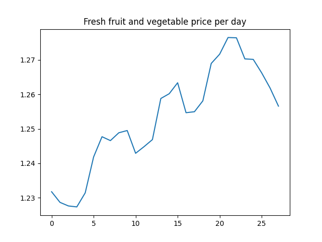
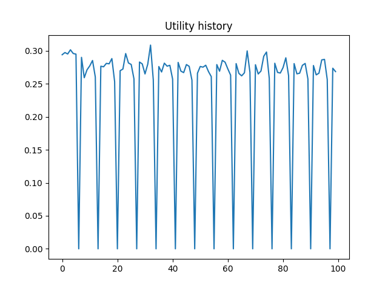
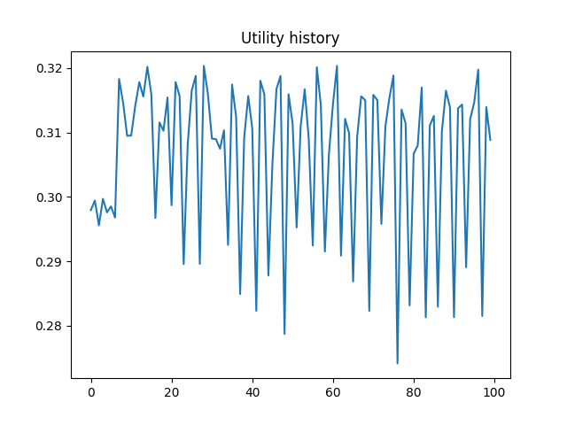

# Food Bank Network Simulation

## Authors
Lucian Li (zilul2)
## Introduction
[Presentation](https://docs.google.com/presentation/d/1ie8jrKpwYENkLppdPkxXw-7WEjA0C7TMuPjkQEXgmps/edit?usp=sharing)
## How to run
code structure

Each module has its own main function to test the specific operation of the module. 

The main simulation runs in run_simulation.py, with the following environment variables:
-num_days = 28  # number of days to run simulation
-inflation_rate = 1.08
-num_food_banks=10 #take top n foodbanks from dataframe
-network_distribution=True # set to False to stop network exchange
    
## Data and sources
We were inspired by a [previous project] (https://github.com/kinjal-shah4/2021Fall_finals). Our underlying data on the locations of food banks and the food insecure population served by each food bank are from this project. 

We curated additional information through interviews with the Eastern Illinois Food Bank and Wesley Food Pantry conducted by Haoyang.

We also downloaded 10 years of price data from the [Bureau of Labor Statistics] (https://www.bls.gov/regions/mid-atlantic/data/averageretailfoodandenergyprices_usandmidwest_table.htm) for each good.

For each food bank, we obtained data on the GDP per capita of the associated metro area from [Wikipedia] (https://en.wikipedia.org/wiki/List_of_U.S._metropolitan_areas_by_GDP_per_capita)

We also conducted additional research on the annual pounds of food distributed and annual programming budget from the financial disclosures of specific food banks. When not found, this data was filled by linear regression with the food insecure population.

Data cleaning and preprocessing are handled in two jupyter notebooks (summarize_food_and_gas_prices.ipynb and populate_foodbank_metadata.ipynb). 

## Model of operation
### Client demand
Three broad types of food are required for healthy living: staple, fruit and vegetables, protein. Under the last two types there are fresh and packaged subtypes. Assume that fresh food is always preferred by clients, and packaged food is a substitute when fresh food is not available. 

Let $T \in \mathbb{R}^3$ denote the weekly physical demand of a household for each type of food, and $q \in \mathbb{R}^3$ denote the food demand that a household meets by purchasing without the help of food banks. $q$ responds to the fluctuation of food price $p \in \mathbb{R}^3$. Assume that the elasticity of demand is constant in the range of price, denoted as $k \in \mathbb{R}^3$, and that the purchase of different types of food are independent. Solving an ODE 
$k = dln(q_i) / dln(p_i)$ we find that $q_i$ is proportional to $(p_i)^{k_i}, i = 1,2,3$. Then using baseline price $p_0^i$ and quantity $q_0^i$, we get $q_i = \frac{q_i^0}{{(p_i^0)}^{k_i}} * {p_i}^{k_i}$.

Assume that each dimension of the individual demand $V \in \mathbb{R}^3$ conforms to a 4-parameter Beta distribution with mean and std given by statistics, and the family size is $S$ with a given discrete distribution. Then, the demand of a household to a food pantry is given by:

$D(p) = SV - q(p) + n$, 
where $n$ is a Gaussian noise. It can be inferred from statistics that $\sum{q(p_0)} \approx 0.6 \sum{SV}$. So for each household, we set $q(p_0)=m*{SV}$ where $m \sim \mathrm{Unif}(0.3, 0.9)$ to reflect the baseline economic conditon of the family. As food price increases, people's affordability decreases and hence need more food from food pantries.

### Purchase and Utility
The frequency of food pantry operation ranges from once a month to three times a week. For this project, we assume that each pantry opens at a fixed day of the week. At that day, clients line up in a random order to shop certain amount of food for the weekly demand of their families. They first shop fresh food, and continue to shop packaged food for the remaining demand of that food type. Fresh food is scarce, so sometimes a quota is set to ensure that everyone can get some.

We consider the utility of food as a monotonic function of the proportion of demand satisfied, $u(0)=0, u(1)=1$. $u$ is concave to reflect diminished marginal utility. We compute the increment in utility from providing food to people, where the utility increment from packaged food is multiplied with 0.7 as a discount. Then we average the utility increment over individuals and food types.

### Foodbank supply

### Foodbank decision-making

### Simulation distribution sampling:
The simulation is responsible for the generation of distributions for good prices, donations, and the daily budget for each food bank. 

## Hypotheses

## Unit Food Bank Simulation
To test that our simulation is working at the Food Bank level, measured daily average utility.
In the following plot, it we observe that average utility stabilizes at around .25, which is the value we expect:

The dips in utility are also reasonable, as they represend days when pantries are not held.

Furthermore, when a food bank is provided with excessive amounts of donations, we have that utility is much higher, reaching around .32 (out of .4):

## Planning
### Presentation

- intro to the problem being addressed: Haoyang
  - hypothesis
- research background: Lucian & Haoyang
  - interviews
  - data
- design: Rodrigo
- code sections: All
- prelim results: All

### Who pays

- receiving foodbank
- ordering food bank

#### Suggestions from Mr. Weible:
(Office hour Dec 1)
- The receiving foodbank pays for transportation
- The economic utility function may or may not be valid. Also make intuitive statistics, e.g. the proportion of clients\
who get no food at all
- Compare the setting of sharing food between foodbanks v.s no sharing
- The simulation doesn't need to be too complicated.

