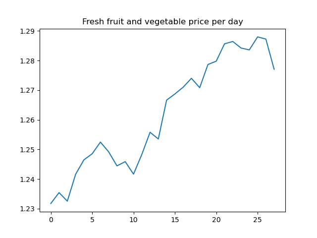

# Food Bank Network Simulation

- [Food Bank Network Simulation](#food-bank-network-simulation)
  - [Authors](#authors)
  - [Introduction](#introduction)
  - [How to run](#how-to-run)
  - [Data and sources](#data-and-sources)
  - [Model of operation](#model-of-operation)
    - [Client demand](#client-demand)
    - [Purchase and Utility](#purchase-and-utility)
    - [Foodbank supply](#foodbank-supply)
    - [Foodbank decision-making](#foodbank-decision-making)
    - [Simulation distribution sampling:](#simulation-distribution-sampling)
    - [Simulation food distribution](#simulation-food-distribution)
  - [Hypotheses](#hypotheses)
    - [Unit Food Bank Simulation](#unit-food-bank-simulation)
    - [Simulation level hypothesis: food sharing](#simulation-level-hypothesis-food-sharing)
  - [Conclusion](#conclusion)
    - [Limitations](#limitations)
    - [Future work](#future-work)

## Authors

Lucian Li (zilul2)

Rodrigo (rodigu)

Haoyang (Liu-Hy)

## Introduction

[Presentation](https://docs.google.com/presentation/d/1ie8jrKpwYENkLppdPkxXw-7WEjA0C7TMuPjkQEXgmps/edit?usp=sharing)

## How to run

code structure

Each module has its own main function to test the specific operation of the module.

The main simulation runs in run_simulation.py, with the following environment variables:

- num_days = 28 # number of days to run simulation
- inflation_rate = 1.08
- num_food_banks=10 #take top n foodbanks from dataframe
- network_distribution=True # set to False to stop network exchange

When it is run, the main method will save daily food waste and weekly average utility to the plots/ directory, as well as printing the average weekly utility and the average waste to the console.

## Data and sources

We were inspired by a [previous project](https://github.com/kinjal-shah4/2021Fall_finals). Our underlying data on the locations of food banks and the food insecure population served by each food bank are from this project.

We curated additional information through interviews with the Eastern Illinois Food Bank and Wesley Food Pantry conducted by Haoyang.

We also downloaded 10 years of price data from the [Bureau of Labor Statistics](https://www.bls.gov/regions/mid-atlantic/data/averageretailfoodandenergyprices_usandmidwest_table.htm) for each good.

For each food bank, we obtained data on the GDP per capita of the associated metro area from [Wikipedia](https://en.wikipedia.org/wiki/List_of_U.S._metropolitan_areas_by_GDP_per_capita)

We also conducted additional research on the annual pounds of food distributed and annual programming budget from the financial disclosures of specific food banks. When not found, this data was filled by linear regression with the food insecure population.

Data cleaning and preprocessing are handled in two jupyter notebooks (summarize_food_and_gas_prices.ipynb and populate_foodbank_metadata.ipynb).

## Model of operation

### Client demand

Three broad types of food are required for healthy living: staple, fruit and vegetables, protein. Under the last two types there are fresh and packaged subtypes. Assume that fresh food is always preferred by clients, and packaged food is a substitute when fresh food is not available.

Let $T \in \mathbb{R}^3$ denote the weekly physical demand of a household for each type of food, and $q \in \mathbb{R}^3$ denote the food demand that a household meets by purchasing without the help of food banks. $q$ responds to the fluctuation of food price $p \in \mathbb{R}^3$. Assume that the elasticity of demand is constant in the range of price, denoted as $k \in \mathbb{R}^3$, and that the purchase of different types of food are independent. Solving an ODE
$k = dln(q_i) / dln(p_i)$ we find that $q_i$ is proportional to $(p_i)^{k_i}, i = 1,2,3$. Then using baseline price $p_0^i$ and quantity $q_0^i$, we get $q_i = \frac{q_i^0}{{(p_i^0)}^{k_i}} * {p_i}^{k_i}$.

Assume that each dimension of the individual demand $V \in \mathbb{R}^3$ conforms to a 4-parameter Beta distribution with mean and std given by statistics, and the family size is $S$ with a given discrete distribution. Then, the demand of a household to a food pantry is given by:

$D(p) = SV - q(p) + n$,
where $n$ is a Gaussian noise. It can be inferred from statistics that $\sum{q(p_0)} \approx 0.6 \sum{SV}$. So for each household, we set $q(p_0)=m*{SV}$ where $m \sim \mathrm{Unif}(0.3, 0.9)$ to reflect the baseline economic conditon of the family. As food price increases, people's affordability decreases and hence need more food from food pantries.

### Purchase and Utility

The frequency of food pantry operation ranges from once a month to three times a week. For this project, we assume that each pantry opens at a fixed day of the week. At that day, clients line up in a random order to shop certain amount of food for the weekly demand of their families. They first shop fresh food, and continue to shop packaged food for the remaining demand of that food type. Fresh food is scarce, so sometimes a quota is set to ensure that everyone can get some.

We consider the utility of food as a monotonic function of the proportion of demand satisfied, $u(0)=0, u(1)=1$. $u$ is concave to reflect diminished marginal utility. We compute the increment in utility from providing food to people, where the utility increment from packaged food is multiplied with 0.7 as a discount. Then we average the utility increment over individuals and food types.

### Foodbank supply

Food bank supply is determined by the simulation for the most part.
Every day it will receive a budget and a donation (in pounds of food).
It will then use those values to purchase and add the donation to its storage.

### Foodbank decision-making

The food banks use all of the received budget to purchase food. The purchase decision is made based on a weekly aggregate demand informed by each pantry.
If two food types are equivalent (such as package and fresh protein), the bank buys whichever is cheapest.

We have decided on simulating a good level of transparency between the banks and the pantries. Each week, a pantry will interact with the bank and order food. That food order is based on how much the food bank has in storage so that it never orders more than it needs. The bank does not estimate its pantry demand based on those orders.

We assume that there is communication between the bank and its pantries on what they would actually like to buy. Therefore, we have two orders that come from pantries: their actual order, and their ideal order. Their ideal order represents what they would request from the bank if there were no storage restrictions. The banks use that ideal order to calculate how much food to buy.

### Simulation distribution sampling:

The simulation is responsible for the generation of distributions for good prices, donations, and the daily budget for each food bank.

The good price is based on a random walk starting from the average price observed over the past 10 years (inflation is handled through a separate multiplier). The weekly distribution is based on a normal distribution of the mean observed daily price change and the standrard deviation of daily change. This movement is additionally modified by a scaler to ensure that the price does not deviate too far from the mean.

Daily food donations and daily budget are both generated by a beta distribution, with mean of the observed daily value, max 2 times daily value, and min half of daily value.

### Simulation food distribution

Before each day is simulated, the simulation organizes the exchange of food between food banks. Each food bank is queried for their projected needs for the near future and their projected expiring food. This is used to generate a potential transport for each food type and pair of food banks. If the total potential value for a food bank pair exceeds the pound per weight to transfer food between the cities, it is identified as a viable pair. The value of the food transported and the total transport cost is then used to evaluated the most economically effective routes. Each food bank will send one shipment per day to the most economically effective receiving food bank. Depending on the simulation setting, money is deducted from the correct food bank's budget.

## Hypotheses

We test the following hypotheses on the operation of the foodbank network: \
**Information transparency**: Different levels of direct communication between levels (client, pantry, food bank) improves efficiency of food allocation\
**Fairness**: Setting quotas on fresh food improves overall food access \
**Collaboration**: Sharing food between food banks improves food access, because expiring food can be transported to where it is needed to reduce waste

### Unit Food Bank Simulation

To test that our simulation is working at the Food Bank level, measured daily average utility.
In the following plot, it we observe that average utility stabilizes at around .25, which is the value we expect:

The dips in utility are also reasonable, as they represend days when pantries are not held.

Furthermore, when a food bank is provided with excessive amounts of donations, we have that utility is much higher, reaching around .32 (out of .4):

For hypothesis 1: If the pantry owner has the accurate information about client demand, the utility increases by 8%, and the proportion of clients who get all their demand satisfied increases from 61% to 70%. In a more realistic setting, if only one pantry has transparent information, it will produce 6% more utility and serve 4% more of its clients\
For hypothesis 2: Setting a fixed limit per client (as a interviewed pantry does) slightly worsens the outcome; setting the limit proportional to the number of people in family improves utility by 1% (small but statistically significant). This raises the question of what is the best practice for fairness for pantry owners.

### Simulation level hypothesis: food sharing

Convergence of weekly utility and food waste at 10 food banks over 28 days. (Utility is undefined on the first week)

The spike in initial food waste comes from overassignment of fresh protein relative to consumer demand in the initial storages.

With the addition of good sharing between networks (transportation paid for by receiving food bank), we do not see a significant change in total utility. This may be because the quantities of excess food are so low at equilibrium that all food banks struggle to provide food to their customers

The average weekly utility is 226,855 with network sharing compared to 226,647, only a 0.09% improvement.

However, we see substantial reductions in food waste across all categories. Staples (162 lbs wasted in exchange compared to 187 lbs (a roughly 15.4% reduction). Fresh fruits, 372 lbs shared compared to 456 not shared, a 22.6% reduction. Protein, 12,033 lbs shared compared to 12,256, a 1.9% reduction.

Because the supply is so far outstripped by the demand for food in our observed data, there is very limited food waste.

A one food bank simulation with actual data inputs shows that there is no excess supply once the initial stockpile is consmed (e.g. the observed daily intake is not enough to fill demand)

The model demonstrates that transportation is effective at reducing the food waste, without reducing the system wide utility through inefficient transport costs. However, these numbers are too low to substantially improve system wide utility as our hypothesis also suggested.

Artificially reducing demand or increasing supply upsets the equilibrium and necessitates further changes to variables and design decisions throughout the program. Further work is necessary to determine which model assumptions result in the dramatic outstripping of supply by demand.

## Conclusion

In general, we have constructed a robust model for the behavior of individual pantries and food banks based on interviews and real data. This model has allowed us to conclusively demonstrate that rationing and increased communication between customers, pantries, and food banks generally improves overall food access. We have also demonstrated that using budgets for transporting excess food between food banks significantly reduces food waste while improving/not harming overall utility.

### Limitations

The main limitation of the project is the relative unreliability of the data sources and the wide range of assumptions we had to make. While somewhat accurate, the yearly budget and food distribution figures for each food bank are unreliable, and may represent different things at different food banks. Because of missing data, we were also forced to rely on regression to generate some of the values.

Furthermore, in designing the simulation, a wide range of ratios, modifiers, distributions are based on our subjective judgement or rough estimation from brief research. The interactions between these assumptions generate a lot of uncertainty and are difficult to test.

Some interactions between different aspects and methods of the classes may also be unpredicable. While the code is well documented and designed, cascading layers of assumptions may problematize the program.

The higher level simulation methods, such as the network distribution, are dependent on so many different stochastic parts and markov chain steps that they often behave unpredicably and are difficult to test/debug.

### Future work

The most pressing future work lies in refining the simulation parameters. While the code design is functional, there are likely demand ratios, population numbers, supply issues, or other problems that vastly lower the supply or inflate the demand for overall function. From our interviews, we know that they often have leftover or expiring food that they distribute to outher food banks. In our current simulation however, food banks very rarely have leftover stocks and the potential exchanges between food banks is extremely limited. This likely reflects a problem in our model design or parameters, however, with our limited data, it is difficult to determine exactly where the issue is. Future work can be focused on verifying and conducting additional research on model design assumptions or data sources.

After model refinement, implementing disaster and system events could improve the adaptability and usefulness of the data. We intended to implement disaster simulation by raising food prices across the board (simulating supply crisis), lowering donations and budgets, as well as vastly boosting the food insecure population (to represent logistical disruption). The food banks would respond to this by rationing and using unlimited free transportation (simulating a government response).
This could occur on either a national or geographically isolated level.
